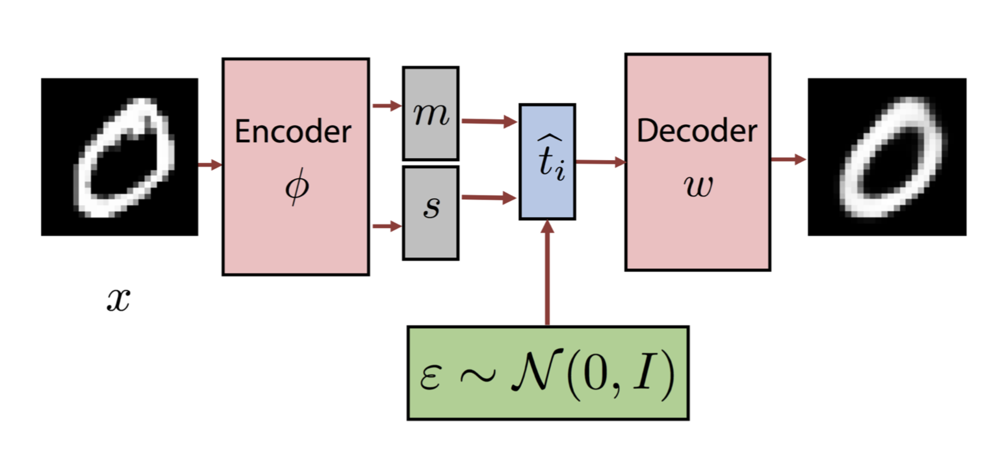
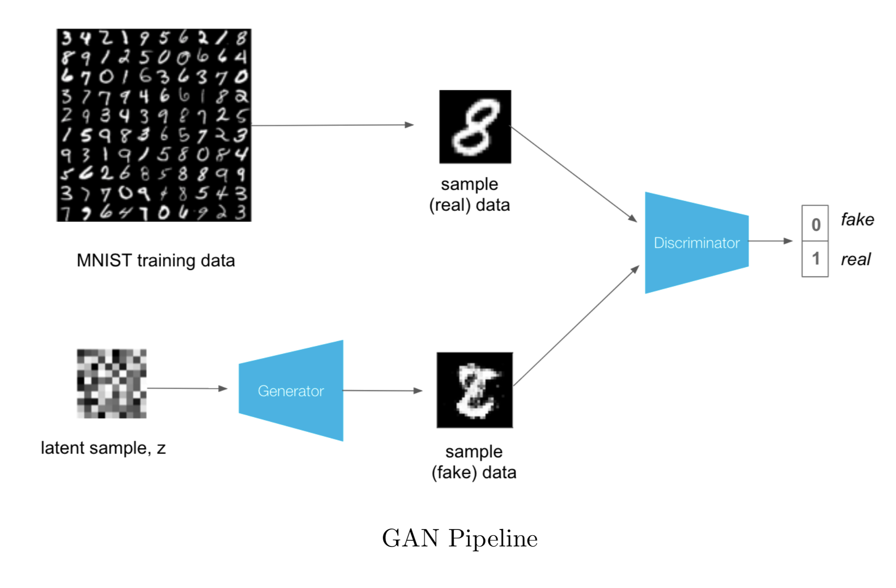
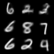
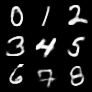

# Deep Generative Models

[](LICENSE)

<p align="center">
  
</p>

## Description

___Variational Auto Encoders___ (VAEs), ___Generative Adversarial Networks (GANs)___ and ___Generative Normalizing Flows (NFs)___ and  are the most famous and powerful deep generative models. With this reposetory, I attempt to gather many deep generative model architectures, within a clean structured code enviroment.
Lastly, I also attempt to analyzed both from theoretical and practical spectrum, with mathematical formulas and annimated pictures.

## [VAE](vae/)

A VAE is a latent variable model that leverages the flexibility of Neural Networks (NN) in order to learn/specify a latent variable model.

### Vanilla VAE
_[Auto-Encoding Variational Bayes](https://arxiv.org/abs/1312.6114)_

<p align="center">
  
</p>

- [Paper](https://arxiv.org/abs/1312.6114), [code](vae/models/vae.py)

### Conditional VAE
_[Learning Structured Output Representation using Deep Conditional Generative Models
](https://papers.nips.cc/paper/5775-learning-structured-output-representation-using-deep-conditional-generative-models)_

<p align="center">
  
</p>

- [Paper](https://papers.nips.cc/paper/5775-learning-structured-output-representation-using-deep-conditional-generative-models), [code](vae/models/cvae.py)


## [GAN](gan/)

Generative Adversarial Networks (GAN) are a type of deep generative models. Similar to VAEs, GANs can generate images that mimick images from the dataset by sampling an encoding from a noise distribution. In constract to VAEs, in vanilla GANs there is no inference mechanism to determine an encoding or latent vector that corresponds to a given data point (or image).


### Vanilla GANs
_[Generative Adversarial Networks](https://arxiv.org/abs/1406.2661)_

<p align="center">
  
</p>

- [Paper](https://arxiv.org/abs/1406.2661), [code](gan/models/gan.py)


## Results
<p align="center">
    
    
</p>
<p align="center">
    From left to right; Vanilla VAE on 2-dimentional space, Conditional VAE on 20-dimentional space.
</p>


<p align="center">
    
</p>
<p align="center">
    Vanilla GAN training progress.
</p>


All the results can be found the folder `vae/logs` (or `gan/logs`) with `tensorboard`:
```
tensorboard --logdir=vae/logs
```

### Running
```
python vae/main.py --model="cvae"
```


### Dependencies
- Python 3.x: PyTorch, NumPy, Tensorboard


### Copyright
Copyright © 2019 Ioannis Gatopoulos.
