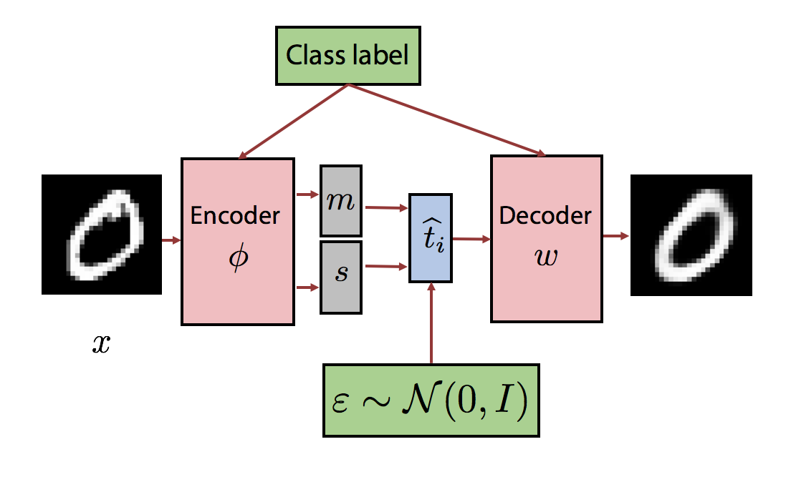

# Deep Generative Models

[](LICENSE)

<p align="center">
  
</p>

## Description
__Variational Auto Encoders__ (VAEs) are one of the most powerful and mathematically beautiful deep generative models.
With this reposetory, I attempt to gather the most popular and advanced VAEs architectures all to gether within a clean structured code enviroment.
Lastly, I also attempt to analyzed both from theoretical and practical spectrum, with mathematical formulas and annimated pictures.

## [VAE](vae/)

A VAE is a latent variable model that leverages the flexibility of Neural Networks (NN) in order to learn/specify a latent variable model.

#### Vanilla VAE
_[Auto-Encoding Variational Bayes](https://arxiv.org/abs/1312.6114)_

<p align="center">
  
</p>

- [Paper](https://arxiv.org/abs/1312.6114), [code](vae/models/vae)

#### Conditional VAE
_[Learning Structured Output Representation using Deep Conditional Generative Models
](https://papers.nips.cc/paper/5775-learning-structured-output-representation-using-deep-conditional-generative-models)_

<p align="center">
  
</p>

- [Paper](https://papers.nips.cc/paper/5775-learning-structured-output-representation-using-deep-conditional-generative-models), [code](vae/models/cvae)


## Results
<p align="center">
    
    
</p>
<p align="center">
    From left to right; Vanilla VAE on 2-dimentional space, Conditional VAE on 20-dimentional space.
</p>


All the results can be found the folder `vae/logs` with `tensorboard`:
```
tensorboard --logdir=vae/logs
```

### Running
```
python vae/main.py --model="cvae"
```


### Dependencies
- Python 3.x: PyTorch, NumPy, Tensorboard


### Copyright
Copyright © 2019 Ioannis Gatopoulos.
