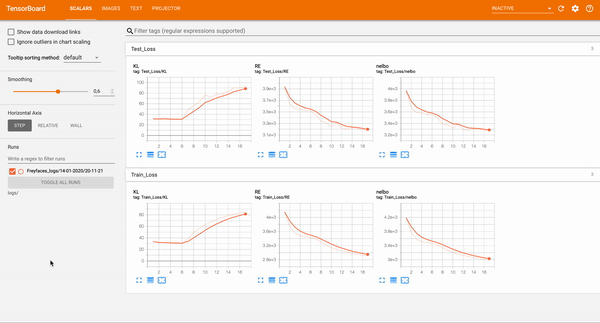

# Variational AutoEncoder in PyTorch
[](LICENSE)

<p align="center">
  
</p>

This repository was designed to provide a flexible and easily adjustable framework in __PyTorch__ for training ___Variational Auto Encoders___  (VAEs), while using powerfull tools as various neural network architectures (DenseNet, ResNet), image distributions (Discretized Logistic and Discretized Mixture of Logistics)
and prior distributions (Mixture of Gaussians, VampPrior).

## Features
- __Priors__
    * Standard (unimodal) Gaussian
    * Mixture of Gaussians
    * VampPrior

- __Reconstruction Loss__
    * MSE
    * Discretized Logistic Loss
    * Discretized Mixture of Logistics Loss

- __Neural Networks__
    * DenseNet
    * ResNet

- __Datasets__
    * MNIST
    * FreyFaces
    * CIFAR-10
    * CelebA

## Tensorboard
* Scalars
* Reconstructions and Generative Samples
* Parameters
* Projector of latent space

<p align="center">
  
</p>

## Results

<p align="center">
  
</p>
<p align="center">
    VAE's leanred manifold of the MNIST dataset of written digits.
</p>


## Run
```
python main.py
```

## Author
Ioannis Gatopoulos.
